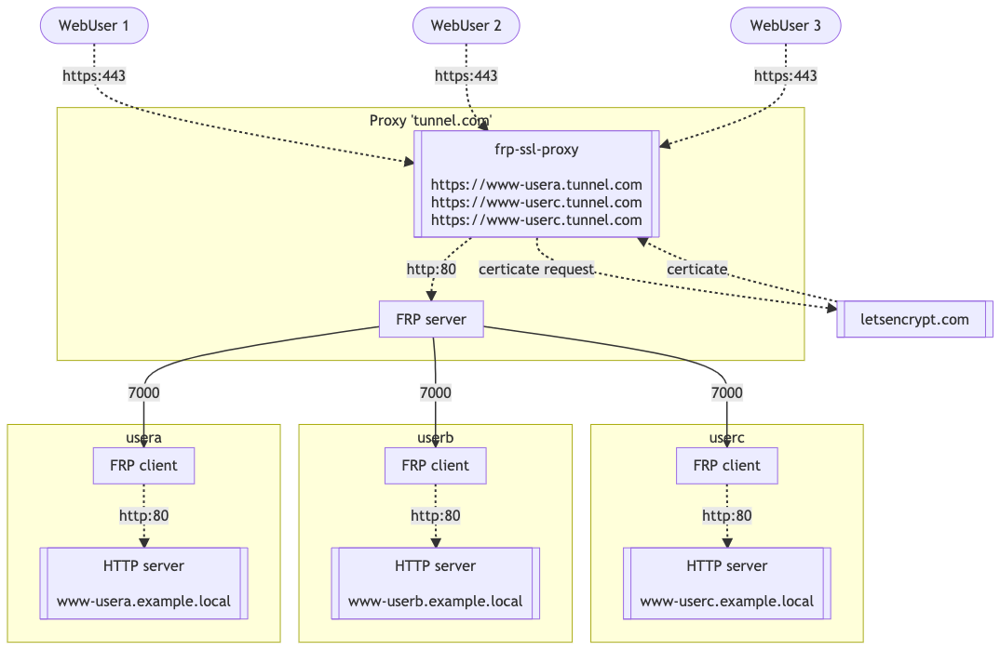

# FRP SSL proxy

## What is FRP-SSL-Proxy

FRP SSL proxy is a plugin to [Fast Reverse Proxy](https://github.com/fatedier/frp). 

It is listening for new client tunnel connection from FRP client, get associate certificates from Let'sEncrypt and expose secured URL of tunnel.

A local store keep trace of previous client hosts and certificates.

It's base on [RedBird](https://github.com/OptimalBits/redbird) NodeJS reverse proxy and is freely inspired by [ACMEProxy](https://github.com/lukacu/docker-frps).

## Architecture

## Example

In `example` folder, you can find a `docker-compose.yml` of a tunnel server and a `frp.ini` for client side configuration`

## Configuration

FRP Let's Encrypt proxy has the following available environment variables

| Variable Name | Purpose | Default value |
| ---  | --- | --- |
| FRP_SSL_PROXY_EMAIL | LetsEncrypt email| test@example.com |
| FRP_SSL_PROXY_PRODUCTION | LetsEncrypt production flag | false |
| FRP_SSL_PROXY_HTTP_PORT | Exposed Http port, used by let's encrypt challenge resolution| 80 |
| FRP_SSL_PROXY_HTTPS_PORT | Exposed Https port, used by tunnels | 443 |
| FRP_SSL_PROXY_LETSENCRYPT_PORT | internal let's encrypt port| 9999 |
| FRP_SSL_PROXY_SUBDOMAIN_HOST | Main frp server domain| tunnel.example.com |
| FRP_SSL_PROXY_PROXY_TARGET | Internal FRP server host, used by https->http reverse proxy | http://frp-server:80 |
| FRP_SSL_PROXY_API_HTTP_PORT | Internal FRP let's encrypt proxy api, used by FRP server on new conection | 9002 |
| FRP_SSL_PROXY_X_FORWARD | X-Forward header flag, used by RedBird| true |
